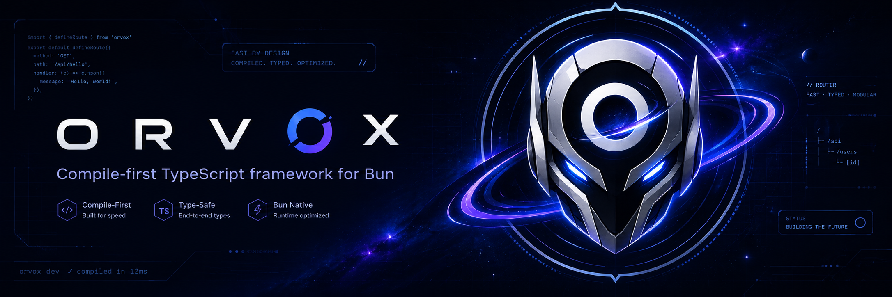

<p align="center">
  
</p>

<p align="center">
  <strong>A compile-first HTTP framework for Bun.</strong><br>
  Routes, schemas, and middleware are resolved at build time into a single readable <code>Bun.serve</code> file.
</p>

<p align="center">
  <a href="https://proamer.github.io/ORVOX/"><strong>Read the handbook →</strong></a>
</p>

<p align="center">
  <code>0.2.0</code> · MIT · requires Bun 1.4+
</p>

---

## What it actually does

Most frameworks re-derive the same answers on every request: walk a route trie, interpret a schema object, iterate a middleware array. ORVOX does that work once, at build time, and writes out the result.

```
Runtime frameworks
Request ──> parse path ──> trie/regexp traversal ──> schema interpreter ──> middleware loop ──> handler

ORVOX
Request ──> native Bun route table ──> inlined if-statements ──> straight-line calls ──> handler
```

- **Routes become a literal object** handed straight to `Bun.serve({ routes })`. There is no matcher in your server — Bun's own path table does the lookup.
- **Schemas become `if` statements.** No validator library is imported or shipped. `t.object({ name: t.string({ min: 2 }) })` compiles down to a `typeof` check and a `.length` check.
- **Middleware becomes straight-line code.** `header()` values are baked into the response, `guard()` becomes an early `return`, `derive()` becomes a named local. No array is iterated at runtime.
- **Nothing else is materialized.** A handler that never touches `query` gets no `new URL()` call. One that reads a single header gets one `headers.get()`, not a whole header object.

The output is a plain TypeScript file you can open, read, and step through in a debugger. If the compiler makes a bad decision, you can see it.

## Quick start

```bash
bun add @orvox/core
```

```bash
bun add -d @orvox/cli
```

Write `src/app.ts`:

```ts
import { orvox, t } from "@orvox/core";

const app = orvox();

app.get("/", () => "hello");
app.get("/users/:id", ({ params }) => ({ id: params.id }));

app.post("/users", {
  body: t.object({ name: t.string({ min: 1 }), age: t.int({ min: 0 }) }),
  handler: ({ body }) => Response.json(body, { status: 201 }),
});

export default app;
```

Compile it, then run what came out:

```bash
bunx orvox build src/app.ts
```

```bash
bun .orvox/server.generated.ts
```

`orvox dev src/app.ts` does the same on a watcher, rebuilding and restarting on every save.

> `@orvox/core` is a set of typed compile markers, not a runtime. Running `bun src/app.ts` directly starts nothing — the server is `.orvox/server.generated.ts`.

## What the compiler emits

Given this input:

```ts
import { header, orvox, t } from "@orvox/core";

const CreateUser = t.object({
  name: t.string({ min: 1, max: 100 }),
  age: t.int({ min: 0, max: 150 }),
});

const app = orvox({ maxRequestBodySize: 16384 });
app.use(header("x-powered-by", "orvox"));

app.post("/users", {
  body: CreateUser,
  handler: ({ body }) =>
    Response.json({ ...body, id: crypto.randomUUID() }, { status: 201 }),
});

export default app;
```

You get this — real output, abridged only where the per-property checks repeat:

```ts
// Generated by ORVOX. Do not edit.

const __orvoxGlobalHeaders: Record<string, string> = {"x-powered-by":"orvox"};

function __orvoxValidationError(path: string, code: string, message: string, headers?: Record<string, string>): Response {
  return Response.json({ error: "VALIDATION_FAILED", issues: [{ path, code, message }] }, { status: 400, headers });
}

export const server = Bun.serve({
  hostname: process.env.HOST ?? "127.0.0.1",
  port: Number(process.env.PORT ?? 3000),
  development: false,
  maxRequestBodySize: 16384,
  error() {
    return new Response("Internal Server Error", { status: 500, headers: __orvoxGlobalHeaders });
  },

  routes: {
    "/users": {
      async POST(req) {
        const __orvoxContentType = req.headers.get("content-type")?.split(";", 1)[0]?.trim().toLowerCase();
        if (__orvoxContentType !== "application/json" && !__orvoxContentType?.endsWith("+json")) return __orvoxValidationError("$", "invalid_content_type", "Expected application/json content type.", {"x-powered-by":"orvox"});
        let __orvoxBody: any;
        try {
          __orvoxBody = await req.json();
        } catch {
          return __orvoxValidationError("$", "invalid_json", "Request body must be valid JSON.", {"x-powered-by":"orvox"});
        }
        if (__orvoxBody === null || typeof __orvoxBody !== "object" || Array.isArray(__orvoxBody)) return __orvoxValidationError("$", "invalid_type", "Expected an object.", {"x-powered-by":"orvox"});
        const __orvoxValue0 = __orvoxBody as Record<string, unknown>;
        if (!Object.hasOwn(__orvoxValue0, "name")) return __orvoxValidationError("$" + ".name", "required", "Required property is missing.", {"x-powered-by":"orvox"});
        const __orvoxValue1: unknown = __orvoxValue0["name"];
        if (typeof __orvoxValue1 !== "string") return __orvoxValidationError("$" + ".name", "invalid_type", "Expected a string.", {"x-powered-by":"orvox"});
        // … min/max length for name, then the same shape of checks for age …
        for (const __orvoxKey3 of Object.keys(__orvoxValue0)) {
          if (!["name","age"].includes(__orvoxKey3)) return __orvoxValidationError("$" + "." + __orvoxKey3, "unknown_property", "Unknown property is not allowed.", {"x-powered-by":"orvox"});
        }
        const body = __orvoxBody;
        const __orvoxOutput = Response.json({ ...body, id: crypto.randomUUID() }, { status: 201 });
        __orvoxOutput.headers.set("x-powered-by", "orvox");
        return __orvoxOutput;
      },
    },
  },
  fetch(req) {
    const path = new URL(req.url).pathname;
    if (path === "/users") {
      const allow = "POST, OPTIONS";
      if (req.method === "OPTIONS") {
        return new Response(null, { status: 204, headers: { ...__orvoxGlobalHeaders, allow } });
      }
      return new Response("Method Not Allowed", {
        status: 405,
        headers: { ...__orvoxGlobalHeaders, allow },
      });
    }
    return new Response("Not Found", { status: 404, headers: __orvoxGlobalHeaders });
  },
});
```

A complete, runnable CRUD service lives in [examples/crud/src/app.ts](examples/crud/src/app.ts).

## Build output

`orvox build` writes four files to `.orvox/`:

| File | What it is |
| --- | --- |
| `server.generated.ts` | The server. This is the only file you deploy and run. |
| `openapi.json` | OpenAPI 3.1, generated from the same IR the validators come from. `info` describes your API, so set it with `orvox({ openapi: { title, version } })` — it defaults to `{ title: "ORVOX API", version: "0.0.0" }`. |
| `routes.manifest.json` | Every route with its params, flattened middleware, response mode, and the exact request data it reads. |
| `analysis.json` | Compiler warnings — dynamic context access, block-handler fallbacks, late global middleware. |

`routes.manifest.json` is worth reading. Its `needs` block tells you precisely what each route pulls off the request, which is usually where a surprise is hiding.

## How it compares

An architectural comparison; measured throughput follows.

| | **ORVOX** | Elysia | Hono | Raw `Bun.serve` |
| :-- | :-: | :-: | :-: | :-: |
| **Route matching** | Native Bun route table, built at compile time | Runtime dynamic tree | Runtime trie | Native route table, hand-written |
| **Validation** | Inlined `if` statements | Runtime JIT (TypeBox) | Runtime parsing (Zod) | Hand-written |
| **Middleware** | Flattened into the handler | Runtime chain | Runtime chain | None |
| **Deployed dependencies** | None — the output imports nothing | Framework + validator | Framework + validator | None |
| **Inspectability** | The whole server is one readable file | Framework internals | Framework internals | Full |
| **OpenAPI** | Build artifact | Runtime schema walk | Manual | Manual |

## Measured throughput

Median req/s over 10 iterations of 20 seconds at concurrency 256, on
`ubuntu-latest` (4 vCPU), from the
[scheduled CI run](https://github.com/proamer/ORVOX/actions/runs/33350712418) of
2026-08-31. Spread — `(max − min) / median` — is beneath each figure, and a gap
smaller than either spread is a tie.

| Workload | Raw `Bun.serve` | **ORVOX** | Elysia | Hono |
| --- | ---: | ---: | ---: | ---: |
| plaintext | 190510 <sub>2.70%</sub> | **189953** <sub>1.75%</sub> | 170582 <sub>4.72%</sub> | 155635 <sub>6.07%</sub> |
| static JSON | 188773 <sub>3.34%</sub> | **190108** <sub>1.36%</sub> | 160590 <sub>6.84%</sub> | 142272 <sub>3.54%</sub> |
| dynamic JSON | 161305 <sub>6.44%</sub> | **163037** <sub>4.19%</sub> | 159322 <sub>6.44%</sub> | 137369 <sub>3.48%</sub> |
| path params | 163638 <sub>8.49%</sub> | **163134** <sub>4.69%</sub> | 158709 <sub>5.74%</sub> | 136547 <sub>6.02%</sub> |

**ORVOX matches hand-written `Bun.serve` on every workload** — the gap runs from
−0.3% to +1.1% and never leaves the noise. That is the point: by request time
there is no framework left to pay for.

Against Hono it leads by 18.7–33.6% everywhere. Against Elysia it leads by
11.4% and 18.4% on the static workloads and ties on the dynamic two — compiling
per-request work away pays most where the handler does least.

Absolute numbers on a shared runner are not a hardware claim; the comparison is,
since all four were measured in one sitting. Methodology, the raw record, and
how to reproduce it: [benchmarks/README.md](benchmarks/README.md).

## Semantics worth knowing

- **Bodies are closed.** Object schemas reject undeclared properties with a `400` / `unknown_property` issue, so nothing can smuggle extra fields into a handler and `Infer<>` is exactly what arrives. OpenAPI mirrors this with `additionalProperties: false`.
- **`query` and `params` convert as well as validate.** Those values arrive as strings, so a `t.int()` declared there parses rather than rejects, and the handler receives a number. A `t.int()` in a body still refuses a string — position decides, and there is no second set of builders. Query maps stay open, unlike bodies: undeclared parameters are ignored rather than rejected.
- **`app.use()` is positional.** Global middleware applies to the routes declared *after* it. Declaring it late is legal but raises `ORVOX_LATE_GLOBAL_MIDDLEWARE` in `analysis.json`.
- **`header()` covers the whole route.** Static headers reach handler results, guard short-circuits, and validation `400`s alike. Globally registered ones also reach the fallback `404` / `405` / `OPTIONS` and the error handler.
- **Groups nest, and middleware accumulates outward-in.** A nested group runs everything its ancestors declared, then its own. `group.use()` still fails the build — middleware belongs in the group options, where it is visible.
- **Everything must be statically readable.** Route paths, schemas, middleware, and hooks are top-level literal declarations with inline handlers. The compiler refuses what it cannot see rather than guessing.
- **Schema bounds are integers**, in both the compiler and the runtime descriptors.

## Feature status

- [x] Compile-time router — `GET`, `POST`, `PUT`, `PATCH`, `DELETE`, `raw`, and typed path params
- [x] Compiled validation — objects, arrays, optionals, string/integer bounds, closed bodies
- [x] Flattened middleware — `header()`, `guard()`, `derive()`, and `group()` prefixes
- [x] Production runtime — `onRequest` / `onError` / `onStop`, body-size limits, graceful shutdown
- [x] WebSockets — compile-time route-id dispatch onto Bun's native handler
- [x] OpenAPI 3.1 as a deterministic build artifact

Emitted helpers are already conditional: `__orvoxResponse`, the validation error builders, and the global header table appear only when a route actually reaches them, and compiled schema and middleware declarations are erased once nothing references them. Dead code *you* wrote is kept verbatim — the compiler copies your non-route statements straight through instead of guessing at reachability. If that matters, run the output through `bun build --minify`, which shakes better than anything worth reimplementing here.

## Packages

| Package | Role |
| --- | --- |
| [@orvox/schema](packages/schema/package.json) | Schema DSL (`t.object`, `t.string`, …) and `Infer<>` |
| [@orvox/core](packages/core/package.json) | Typed app surface: routes, middleware, hooks, WebSockets |
| [@orvox/compiler](packages/compiler/package.json) | AST analysis, code emission, OpenAPI generation |
| [@orvox/cli](packages/cli/package.json) | `orvox build`, `orvox inspect`, `orvox dev` |

## Working on ORVOX

Bun is not a dependency of this workspace — install it yourself, since the
compiler targets whichever `bun` is on your `PATH`.

```bash
pnpm install
```

```bash
pnpm check
```

`pnpm check` compiles the fixture app, type-checks the workspace *including the generated server*, and runs the full Bun test suite. It is the same gate CI runs.

Benchmarks need [`oha`](https://github.com/hatoo/oha) installed. The smoke run verifies all four frameworks serve identical responses before any timing is trusted:

```bash
pnpm bench:smoke
```

Publishing is manual and gated. `pnpm pack:alpha` writes local tarballs to `artifacts/` for inspection; the [publish workflow](.github/workflows/publish.yml) is `workflow_dispatch`-only. It holds no npm secret — releases authenticate through npm trusted publishing (OIDC), so every published version carries SLSA provenance tying it back to the commit and workflow run that built it.

The task-by-task guide lives at [proamer.github.io/ORVOX](https://proamer.github.io/ORVOX/), built from [docs/index.html](docs/index.html). Design decisions are recorded in [docs/decisions](docs/decisions); the compiler pipeline is sketched in [docs/architecture.md](docs/architecture.md).

## License

MIT © PROAMER — see [LICENSE](LICENSE).
